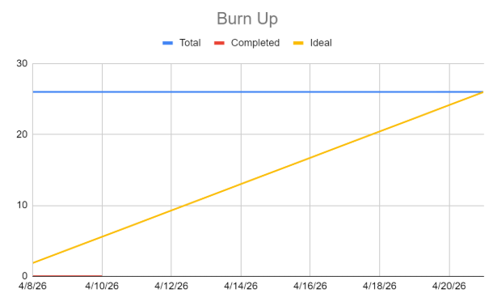
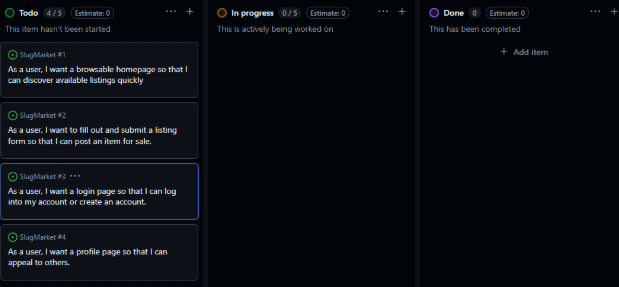

# SPRINT 1 PLAN 
### Completion Date: 4/21/26

## Goal: Build the necessary user interfaces needed to implement functionality in upcoming sprints.

### User story 1: As a user, I want a browsable homepage so that I can discover available listings quickly. (8 SP)
- **Task 1:** Create a simple homepage UI, to hold mock listings in a grid. (Time est: 2 hrs, 3 SP)  
    - 3:4 image ratio
    - use instagram explore page for grid reference 

- **Task 2:** Add button for favorited listings. (Time est: 1 hr, 1 SP)

- **Task 3:** Add ability to swipe between listings. (Time est: 3 hrs, 4 SP)
    - activates once the user clicks an image from grid-view. 
    - think IG reels but for images/listings

**Total for user story 1:** 6 hrs
	
### User story 2: As a user, I want to fill out and submit a listing form so that I can post an item for sale. (8 SP)

- **Task 1:** Design a form UI to input listing data. (Time est: 3 hrs, 4 SP)
    - product title
    - description
    - asking price
    - button to upload images
    - condition
    - submit button

- **Task 2:** Setup database to store list data.  (Time est: 2 hrs, 2 SP)
    - use relational database
    - listing id, username, item name, item description, price, description

- **Task 3:** Link “submit” button to database.  (Time est: 1 hr, 2 SP)

**Total for user story 2:** 6 hrs

### User story 3: As a user, I want a login page so that I can log into my account or create an account. (5 SP)
- **Task 1:** Create a responsive login page with a simple and aesthetically pleasing UI. (Time est:  3 hrs, 3 SP)
    - login button
    - signup button
    - text-boxes to input an email/username and password
    - SlugMarket logo. 

- **Task 2:** Setup database to store user credentials. (Time est: 2 hrs, 1 SP)
    - use Supabase Auth
    - email, username, password

- **Task 3:** Add verification. (Time est: 2 hrs, 1 SP)
    - check for ucsc email when signing up

- **Task 4:**
    - check for invalid username/invalid password when logging in

**Total for user story 3:** 7 hrs

### User story 4: As a user, I want a profile page so that I can appeal to others. (5 SP)
- **Task 1:** Create a profile page UI. (Time est: 3 hrs, 3 SP)
    - profile picture
    - username
    - number of listings
    - number of sold items.

- **Task 2:** Add space for current listings and sold listings separated by category (Time est:  2 hrs, 2 SP)

**Total for user story 4:** 5 hrs

### Team roles:
- Andrew Le - Product Owner, 
- Miguel Zavala - Scrum Master
- Kenny Young - Team Member
- Luis Del Rosario - Team Member

### Initial task assignment:
- Andrew Le - user story 3, task 2
- Miguel Zavala - user story 2, task 1
- Kenny Young - user story 1, task 1
- Luis Del Rosario - user story 4, task 1

### Initial burnup chart:

### Initial scrum board:

### Scrum times:
- Monday: 1pm - 2pm
- Wednesday: 1pm - 2pm (TA included)
- Friday: 1pm - 2pm
