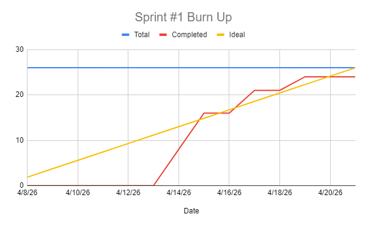

# Sprint 1 Report

### Actions to stop doing: 
The team should stop being inconsistent with communication in Discord, because timely responses are essential for coordinating tasks and catching blockers early. 

### Actions to start doing:
The team should start holding each other accountable for consistent contributions to the product, because inconsistent output across members resulted in a user story not being completed during Sprint 1. 

### Actions to keep doing: 
The team should keep holding regular scrum meetings three times a week (Monday, Wednesday, and Friday at 1pm), because this provides consistent opportunities to sync on progress and catch issues early. 

### Completed user stories:
- As a user, I want a browsable homepage so that I can discover available listings quickly. (8 SP)
- As a user, I want to fill out and submit a listing form so that I can post an item for sale. (8 SP)
- As a user, I want a login page so that I can log into my account or create an account. (5 SP)

### Not completed user stories:
- As a user, I want a profile page so that I can appeal to others. (5 SP)

### Work completion rate:

