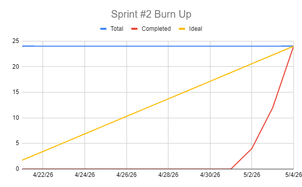

# Sprint 2 Report

### Actions to stop doing: 
The team should stop waiting until the last minute to complete tasks, because poor time management creates unnecessary pressure and reduces the overall quality of our work. 

### Actions to start doing:
The team should start writing more detailed and clearly defined tasks, because vague descriptions make it harder to estimate effort accurately and can lead to misaligned expectations during the sprint. 

### Actions to keep doing: 
The team should keep building on the communication improvements we have made, because staying responsive and in sync with one another helps us catch issues early and deliver more consistent results.  

### Completed user stories:
- As a user, I want to view listing details so that I can decide whether to buy an item. (3 SP)
- As a user, I want to search listings by keyword so that I can quickly find items I'm looking for. (3 SP)
- As a user, I want to filter listings so that I can narrow results by price or category. (5 SP)
- As a user, I want my own listings to display on my profile so that I can track what I currently have for sale. (3 SP)
- As a user, I want to bookmark listings so that I can keep track of the items I’m interested in. (5 SP)
- As a user, I want to visit other users' profiles so that I can learn about sellers before buying from them and also see what other things they could be selling. (5 SP)

### Not completed user stories:
- N/A

### Work completion rate:

