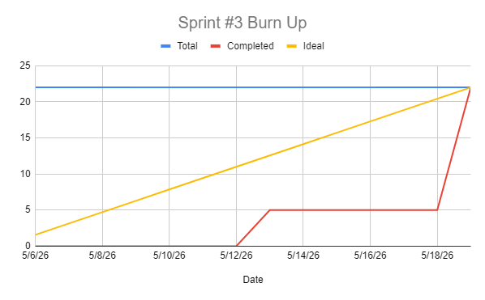

# Sprint 3 Report

### Actions to stop doing: 
The team should stop struggling with time management, because this is a recurring issue that has now caused user stories to spill over into a sprint 4. 

### Actions to start doing:
The team should start setting internal mid-sprint deadlines for individual tasks, because having a personal checkpoint before the sprint ends would help catch time management issues earlier and allow the team to redistribute work before it's too late. 

### Actions to keep doing: 
The team should keep up the improvements made to both communication and task clarity, because the progress made since Sprint 2's retrospective has had a positive impact on how the team coordinates and understands the scope of their work.  

### Completed user stories:
- As a user, I want to edit/delete my listings so that I can keep my listings accurate or remove sold items. (5 SP)
- As a user, I want to mark a listing as sold so that buyers know it's no longer available. (2 SP)
- As a user, I want to be able to upload a profile picture so that others can see what I look like. (3 SP)
- As a user, I want to see the count of other users interested in my listing so that I can better manage offering or editing listings. (1 SP)

### Not completed user stories:
- As a user, I want a messaging page so that I can keep track of my messages. (8 SP)
- As a buyer, I want an offering button and system so that I can easily make an offer that shows up rather than possibly going unseen by the seller. (3 SP)

### Work completion rate:

