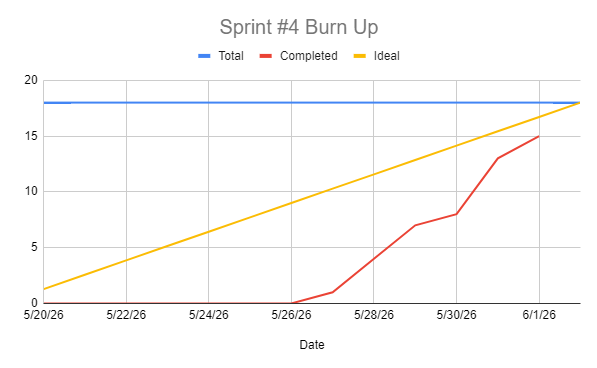

# Sprint 4 Report

### Actions to stop doing: 
The team should stop shipping new features without accompanying unit tests, because the absence of tests with each new feature increases the risk of undetected regressions and makes future changes harder to verify. 

### Actions to start doing:
The team should start writing unit tests alongside each new feature as it's developed, because building test coverage incrementally is more reliable than deferring it and helps catch bugs before they reach production. 

### Actions to keep doing: 
The team should keep up the high level of contribution seen this sprint, because the large spike in contributions across members allowed user stories to be completed more smoothly and efficiently than in previous sprints. 

### Completed user stories:
- As a user, I want to review or rate sellers and buyers so that I can help other users make informed decisions. (3 SP)
- As a user, I want my ratings/reviews to display on my profile so other users can determine if I'm trustworthy. (3 SP)
- As a user, I want to see the total amount of items sold on a seller's profile page to help understand their reputation as a good or experienced seller. (1 SP)
- As a user, I want to add a bio to my profile page so that other users can learn about me before transacting. (1 SP)
- As a user, I want to report a listing or user so that I can flag suspicious or inappropriate content. (2 SP)
- As a user, I want to report and block a chat so that I can stay clear of inappropriate or rude behavior. (3 SP)
- As a user, I want an inbox so that I can be notified of agreements being made or a person interested in my item, etc. (5 SP)

### Not completed user stories:

### Work completion rate:

